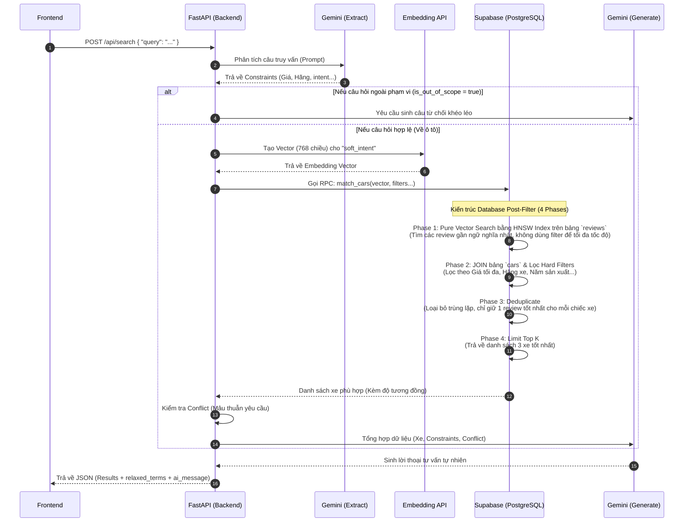

# Tài liệu Tích hợp Frontend

Tài liệu này cung cấp hướng dẫn tích hợp dựa trên kiến trúc mới nhất của hệ thống **AutoMatch AI**. Để tối ưu hóa hiệu năng và bảo mật, dự án đã chuyển đổi sang mô hình **Supabase-first**.

**Tổng quan kiến trúc:**
- Các thao tác CRUD (Thêm/Đọc/Sửa/Xóa) cơ bản được thực hiện trực tiếp từ Frontend thông qua thư viện `supabase-js`.
- Backend FastAPI hiện chỉ đảm nhiệm việc xử lý logic trí tuệ nhân tạo (AI Vector Search & RAG).

---

## 1. Cơ chế Xác thực và Bảo mật (RLS)

Frontend quản lý việc xác thực người dùng thông qua Supabase Auth:
1. Sử dụng `supabase.auth.signInWithPassword()` hoặc các phương thức tương tự để xác thực.
2. Khi thực hiện các thao tác CRUD lên Database, thư viện `supabase-js` tự động đính kèm Token của người dùng vào request.
3. **Bảo mật cấp dòng (Row Level Security - RLS):** Database Postgres tự động kiểm tra quyền truy cập dựa trên Token. Người dùng chỉ có thể thao tác trên dữ liệu thuộc quyền sở hữu của họ.

---

## 2. Thao tác Dữ liệu (CRUD)

*Lưu ý: Các endpoint RESTful truyền thống (`/api/cars`, `/api/users`, `/api/cart`, `/api/admin`) trên FastAPI đã được gỡ bỏ.*

Các thao tác cơ sở dữ liệu sẽ gọi trực tiếp đến Supabase. Dưới đây là các ví dụ tham khảo:

### 2.1. Truy vấn Dữ liệu (Ví dụ: Danh sách xe)
```javascript
const { data, error } = await supabase
  .from('cars')
  .select('*')
  .eq('make', 'Toyota')
  .lte('price', 50000)
  .limit(20);
```

### 2.2. Thao tác Giỏ hàng
```javascript
// Lấy giỏ hàng của người dùng đang đăng nhập
const { data: cartData, error: cartError } = await supabase
  .from('cart_items')
  .select('*, cars(*)');

// Thêm sản phẩm vào giỏ hàng
const { data: insertData, error: insertError } = await supabase
  .from('cart_items')
  .insert([{ car_id: 'UUID_CỦA_XE', quantity: 1 }]);
```

### 2.3. Thanh toán (Stored Procedure)
Hệ thống cung cấp sẵn hàm RPC an toàn cho các giao dịch.
```javascript
const { data, error } = await supabase
  .rpc('checkout_cart', { 
    p_user_id: user.id, 
    p_payment_method: 'credit_card' 
  });
// Trả về order_id nếu giao dịch thành công
```

### 2.4. Quản trị (Admin)
Chỉ người dùng có `role = 'admin'` mới có quyền Insert/Update trên bảng `cars`. Bất kỳ nỗ lực thay đổi dữ liệu từ người dùng không có quyền sẽ bị từ chối với lỗi 403 Forbidden.
```javascript
const { data, error } = await supabase
  .from('cars')
  .update({ is_active: false }) // Soft delete
  .eq('id', carId);
```

---

## 3. Tích hợp AI Search (FastAPI)

Endpoint duy nhất đi qua Backend FastAPI (`http://localhost:8000`) là API tìm kiếm, vì quá trình này đòi hỏi xử lý bảo mật (API Key) và logic phức tạp (Vector Hybrid Search).

### 3.1. Luồng hoạt động (Workflow) chi tiết

Dưới đây là sơ đồ chi tiết toàn bộ quá trình diễn ra khi Frontend gọi API tìm kiếm, giúp cả Frontend và Backend hiểu rõ kiến trúc hệ thống:



### 3.2. Tìm kiếm AI bằng ngôn ngữ tự nhiên
- **Endpoint:** `POST /api/search`
- **Body Request:** 
  ```json
  { 
    "query": "Tôi muốn mua xe thể thao 2 cửa, tài chính 2 tỷ" 
  }
  ```
- **Response Format:**
  ```json
  {
    "original_query": "Tôi muốn mua xe thể thao...",
    "constraints": {
      "max_price": 2000000000,
      "min_hp": null,
      "make": null,
      "target_year": null,
      "fuel_type": null,
      "is_out_of_scope": false,
      "soft_intent": "Xe thể thao 2 cửa"
    },
    "results": [
      {
        "id": "uuid-...",
        "make": "Porsche",
        "model": "911",
        "year": 2023,
        "price": 2000000000,
        "review": "Cảm giác lái tuyệt vời...",
        "similarity": 0.89
      }
    ],
    "conflict_detected": false,
    "relaxed_terms": [],
    "ai_message": "Với ngân sách 2 tỷ và yêu cầu xe thể thao 2 cửa, hệ thống đã tìm được chiếc Porsche 911 phù hợp."
  }
  ```
- **Ứng dụng:** Sử dụng trường `ai_message` để hiển thị phản hồi từ Chatbot hoặc giao diện AI tạo sinh. Sử dụng trường `results` để hiển thị danh sách các thẻ sản phẩm tương ứng.
