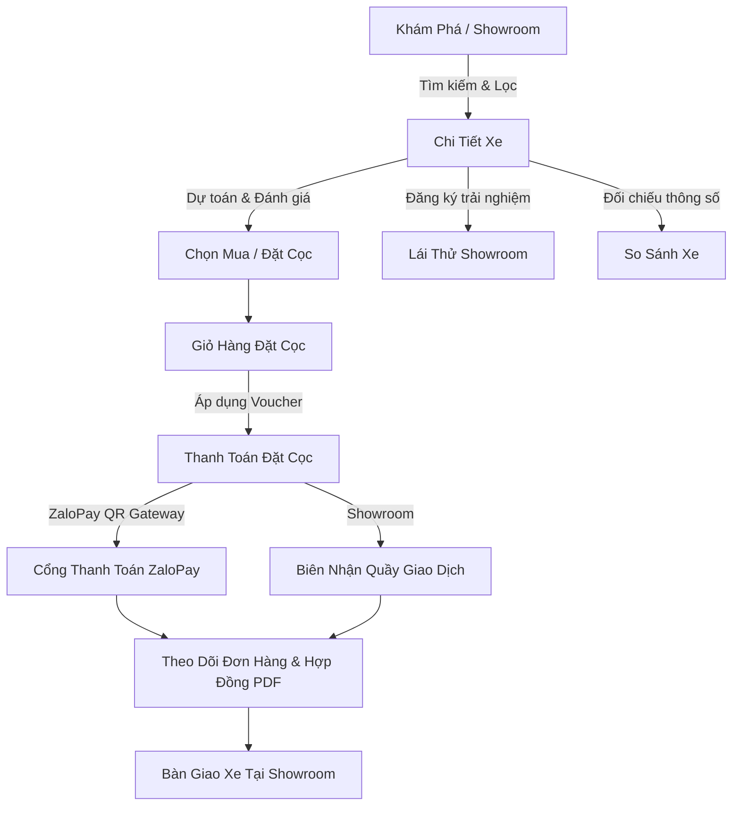

# 🎨 AutoMatch AI - Automotive E-Commerce Design System Standard

Bản tài liệu tiêu chuẩn thiết kế (Design System & Standards) đồng bộ cho toàn bộ hệ thống ứng dụng thương mại điện tử ô tô **AutoMatch AI**.

---

## 1. Triết Lý Thiết Kế (Design Philosophy)

Ứng dụng hướng đến phong cách **Cyber-Luxury Automotive Dark Theme**:
- **Sang trọng & Đẳng cấp:** Tông màu đen Titanium sâu kết hợp các bề mặt nổi Slate mờ mang lại trải nghiệm buồng lái kỹ thuật số (digital cockpit) cao cấp của các dòng xe hạng sang (Porsche, Mercedes, BMW, Audi, VinFast).
- **Hiện đại & Trực quan (Generative E-Commerce):** Tích hợp công nghệ cao với các điểm nhấn Neon Cyan (`#00E5FF`) và Electric Purple (`#7C4DFF`), phản ánh sức mạnh của AI RAG và công nghệ xe điện tương lai.
- **Đồng bộ tuyệt đối (Unified Consistency):** Mọi màn hình từ Khám phá, Showroom, Chi tiết sản phẩm, So sánh, Giỏ hàng, Thanh toán ZaloPay, Đơn hàng, Lịch lái thử đến Trợ lý AI đều tuân thủ 100% các Design Tokens và UI Primitives tiêu chuẩn.

---

## 2. Bảng Màu Tiêu Chuẩn (Color Tokens)

```typescript
export const colors = {
  // Nền & Bề mặt
  background: '#0B0E14',          // Nền chính đen Titanium Obsidian
  surface: '#141A26',             // Bề mặt cấp 1 (Header, Tab bar, Containers)
  surfaceElevated: '#1C2333',     // Bề mặt cấp 2 (Thẻ xe, Form inputs, Bottom sheets)
  surfaceGlass: 'rgba(28, 35, 51, 0.85)', // Hiệu ứng kính mờ (Glassmorphism)

  // Đường viền & Phân cách
  border: '#253046',              // Viền tiêu chuẩn
  borderHighlight: 'rgba(0, 229, 255, 0.35)',

  // Màu thương hiệu & Điểm nhấn
  primary: '#00E5FF',             // Electric Cyan (Hành động chính, Giá tiền, Điểm nhấn)
  primaryMuted: 'rgba(0, 229, 255, 0.12)',
  secondary: '#7C4DFF',           // Electric Purple (Tag AI, So sánh, VIP)
  secondaryMuted: 'rgba(124, 77, 255, 0.15)',

  // Trạng thái ngữ nghĩa (Semantic)
  conflict: '#FFB300',            // Amber Gold (Cảnh báo mâu thuẫn AI, Sao đánh giá, VIP)
  conflictMuted: 'rgba(255, 179, 0, 0.15)',
  success: '#00E676',             // Mint Emerald (Đã thanh toán, Sẵn xe, Đã duyệt)
  danger: '#FF5252',              // Coral Red (Xóa, Hủy đơn, Giảm giá đặc biệt)
  
  // Màu chữ (Typography)
  text: '#F2F5F8',                // Chữ chính độ tương phản cao (Ice White)
  textSecondary: '#94A3B8',       // Chữ phụ (Soft Slate)
  textMuted: '#64748B',           // Chữ chú thích, thời gian
  textDark: '#0B0E14',            // Chữ đen trên nền Cyan/Gold
};
```

---

## 3. Hệ Thống Spacing & Bo Góc (Spacing & Radii)

| Token | Giá trị (px) | Ứng dụng |
| :--- | :--- | :--- |
| `spacing.xs` | `4px` | Khoảng cách icon nhỏ, tag badge |
| `spacing.sm` | `8px` | Khoảng cách giữa các chip, padding nút nhỏ |
| `spacing.md` | `12px` | Padding trong của card nhỏ, gutter |
| `spacing.lg` | `16px` | Padding lề chuẩn màn hình (`screenPadding`) |
| `spacing.xl` | `20px` | Khoảng cách giữa các section |
| `spacing.2xl` | `24px` | Margin lớn giữa các khối nội dung |
| `radii.sm` | `8px` | Bo góc nút nhỏ, input, chip |
| `radii.md` | `12px` | Bo góc ảnh thumbnail, card danh sách |
| `radii.lg` | `16px` | Bo góc thẻ sản phẩm lớn, modal, sheet |
| `radii.full` | `9999px`| Bo tròn hoàn toàn (Pill, Avatar, Icon tròn) |

---

## 4. Danh Sách UI Primitives Chuẩn Hóa (`src/components/ui/`)

1. **`Button`**: Hỗ trợ 6 biến thể (`primary`, `secondary`, `outline`, `ghost`, `danger`, `conflict`), 3 kích thước (`sm`, `md`, `lg`), loading spinner, icon trái/phải.
2. **`Badge`**: Tag thông tin với 8 biến thể màu (`primary`, `secondary`, `conflict`, `warning`, `success`, `danger`, `gold`, `outline`), hỗ trợ chấm trạng thái `dot`.
3. **`Card`**: Khung chứa đồng bộ với 5 biến thể (`default`, `elevated`, `glass`, `highlight`, `conflict`), hỗ trợ bấm chạm `onPress`.
4. **`Input`**: Trường nhập liệu với nhãn tiêu chuẩn, icon định dạng, hỗ trợ trạng thái lỗi `error` và bắt buộc `required`.
5. **`SearchBar`**: Thanh tìm kiếm tích hợp nút xóa nhanh, kích hoạt bộ lọc với huy hiệu đếm tiêu chí, và phím tắt AI.
6. **`PillFilter`**: Thanh cuộn chọn danh mục xe dạng viên thuốc (Pill), hỗ trợ đếm số lượng xe trong danh mục.
7. **`RatingStars`**: Hệ thống hiển thị và đánh giá 5 sao tương tác.
8. **`PriceTag`**: Hiển thị giá tiền định dạng chuẩn Việt Nam (Tỷ VNĐ / Triệu VNĐ) kèm tính năng dự toán trả góp tự động.
9. **`SectionHeader`**: Tiêu đề phân mục có phụ đề và liên kết "Xem tất cả".
10. **`EmptyState`**: Màn hình rỗng có minh họa icon và nút điều hướng tương ứng.
11. **`ModalSheet`**: Bottom sheet trượt mượt mà cho bộ lọc, đặt lái thử, dự toán vay và đánh giá xe.

---

## 5. Danh Sách E-Commerce Feature Components (`src/components/car/`)

- **`CarCard`**: Hiển thị thẻ xe đa năng hỗ trợ cả dạng **Grid** và dạng **List**, tích hợp nút Yêu thích, So sánh nhanh, Thêm giỏ cọc, và huy hiệu AI Match Score.
- **`CarFilterModal`**: Bộ lọc đa tiêu chí (Hãng xe, Kiểu dáng xe, Khoảng giá, Loại nhiên liệu, Thứ tự sắp xếp).
- **`InstallmentCalculator`**: Bảng dự toán vay mua xe trả góp tương tác với các mức trả trước (20-70%), thời hạn vay (1-7 năm), lãi suất cố định và lịch trả góp hàng tháng.
- **`TestDriveModal`**: Đặt lịch lái thử chọn Showroom trong 4 thành phố lớn, chọn ngày và khung giờ thuận tiện.
- **`ReviewModal`**: Biểu mẫu viết đánh giá & chấm sao mức độ hài lòng.
- **`QAModal`**: Biểu mẫu gửi câu hỏi trực tiếp cho đội ngũ chuyên gia AutoMatch.
- **`CarSpecTable`**: Bảng ma trận 14 thông số kỹ thuật chi tiết của từng mẫu xe.

---

## 6. Luồng E-Commerce Hoàn Chỉnh


