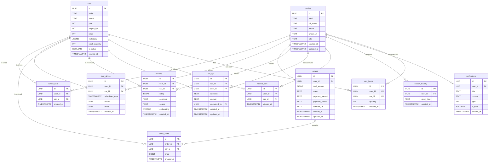
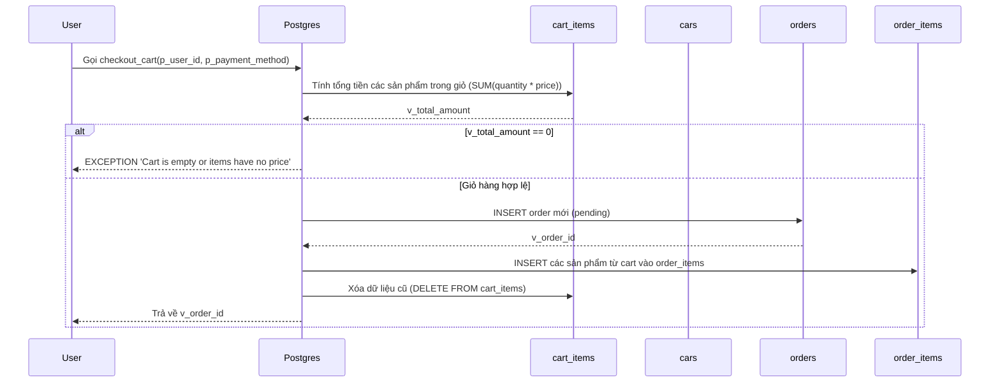
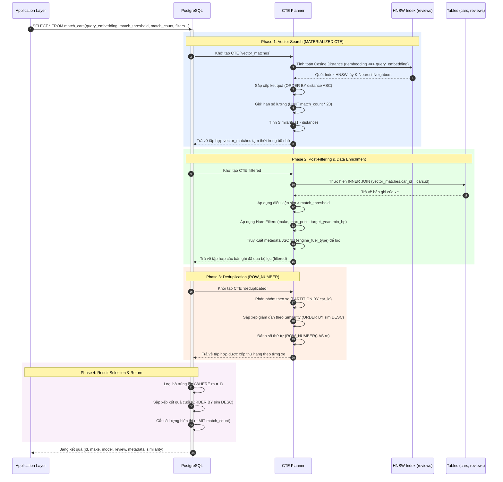

# Cấu trúc Database & Hoạt động Hàm

## 1. Biểu đồ cấu trúc DB (ERD)

```mermaid
erDiagram
    profiles {
        UUID id PK
        TEXT email
        TEXT full_name
        TEXT phone
        TEXT avatar_url
        TEXT role
        TIMESTAMPTZ created_at
        TIMESTAMPTZ updated_at
    }
    
    cars {
        UUID id PK
        TEXT make
        TEXT model
        INT year
        INT engine_hp
        INT price
        JSONB metadata
        INT stock_quantity
        BOOLEAN is_active
        TIMESTAMPTZ created_at
    }

    saved_cars {
        UUID id PK
        UUID user_id FK
        UUID car_id FK
        TIMESTAMPTZ created_at
    }

    test_drives {
        UUID id PK
        UUID user_id FK
        UUID car_id FK
        TIMESTAMPTZ scheduled_date
        TEXT status
        TEXT notes
        TIMESTAMPTZ created_at
    }

    orders {
        UUID id PK
        UUID user_id FK
        BIGINT total_amount
        TEXT status
        TEXT payment_method
        TEXT payment_status
        TEXT contract_url
        TIMESTAMPTZ created_at
        TIMESTAMPTZ updated_at
    }

    order_items {
        UUID id PK
        UUID order_id FK
        UUID car_id FK
        BIGINT price
        TIMESTAMPTZ created_at
    }

    reviews {
        UUID id PK
        UUID user_id FK
        UUID car_id FK
        FLOAT rating
        TEXT comment
        TEXT source
        VECTOR embedding
        TIMESTAMPTZ created_at
    }

    car_qa {
        UUID id PK
        UUID car_id FK
        UUID user_id FK
        TEXT question
        TEXT answer
        UUID answered_by FK
        TIMESTAMPTZ created_at
        TIMESTAMPTZ updated_at
    }

    viewed_cars {
        UUID id PK
        UUID user_id FK
        UUID car_id FK
        TIMESTAMPTZ viewed_at
    }

    search_history {
        UUID id PK
        UUID user_id FK
        TEXT query_text
        TIMESTAMPTZ created_at
    }

    notifications {
        UUID id PK
        UUID user_id FK
        TEXT title
        TEXT content
        TEXT type
        BOOLEAN is_read
        TIMESTAMPTZ created_at
    }

    cart_items {
        UUID id PK
        UUID user_id FK
        UUID car_id FK
        INT quantity
        TIMESTAMPTZ created_at
    }

    profiles ||--o{ saved_cars : "has"
    profiles ||--o{ test_drives : "books"
    profiles ||--o{ orders : "places"
    profiles ||--o{ reviews : "writes"
    profiles ||--o{ car_qa : "asks/answers"
    profiles ||--o{ viewed_cars : "views"
    profiles ||--o{ search_history : "searches"
    profiles ||--o{ notifications : "receives"
    profiles ||--o{ cart_items : "adds"

    cars ||--o{ saved_cars : "is saved"
    cars ||--o{ test_drives : "is driven"
    cars ||--o{ order_items : "is ordered"
    cars ||--o{ reviews : "is reviewed"
    cars ||--o{ car_qa : "has QA"
    cars ||--o{ viewed_cars : "is viewed"
    cars ||--o{ cart_items : "is in cart"
    
    orders ||--o{ order_items : "contains"
```

## 2. Sơ đồ tuần tự hoạt động của các hàm

### Hàm `checkout_cart`

```mermaid
sequenceDiagram
    participant User
    participant DB as Postgres
    participant Cart as cart_items
    participant Cars as cars
    participant Orders as orders
    participant OrderItems as order_items

    User->>DB: Gọi checkout_cart(p_user_id, p_payment_method)
    DB->>Cart: Tính tổng tiền các sản phẩm trong giỏ (SUM(quantity * price))
    Cart-->>DB: v_total_amount
    
    alt v_total_amount == 0
        DB-->>User: EXCEPTION 'Cart is empty or items have no price'
    else Giỏ hàng hợp lệ
        DB->>Orders: INSERT order mới (pending)
        Orders-->>DB: v_order_id
        DB->>OrderItems: INSERT các sản phẩm từ cart vào order_items
        DB->>Cart: Xóa dữ liệu cũ (DELETE FROM cart_items)
        DB-->>User: Trả về v_order_id
    end
```

### Hàm `match_cars` (Vector Search RAG)

```mermaid
sequenceDiagram
    autonumber
    participant App as Application Layer
    participant PG as PostgreSQL
    participant CTE as CTE Planner
    participant HNSW as HNSW Index (reviews)
    participant Tables as Tables (cars, reviews)

    App->>PG: SELECT * FROM match_cars(query_embedding, match_threshold, match_count, filters...)
    activate PG
    
    rect rgb(230, 240, 255)
        Note over PG,HNSW: Phase 1: Vector Search (MATERIALIZED CTE)
        PG->>CTE: Khởi tạo CTE `vector_matches`
        CTE->>HNSW: Tính toán Cosine Distance (r.embedding <=> query_embedding)
        HNSW-->>CTE: Quét Index HNSW lấy K-Nearest Neighbors
        CTE->>CTE: Sắp xếp kết quả (ORDER BY distance ASC)
        CTE->>CTE: Giới hạn số lượng (LIMIT match_count * 20)
        CTE->>CTE: Tính Similarity (1 - distance)
        CTE-->>PG: Trả về tập hợp vector_matches tạm thời trong bộ nhớ
    end
    
    rect rgb(230, 255, 230)
        Note over PG,Tables: Phase 2: Post-Filtering & Data Enrichment
        PG->>CTE: Khởi tạo CTE `filtered`
        CTE->>Tables: Thực hiện INNER JOIN (vector_matches.car_id = cars.id)
        Tables-->>CTE: Trả về bản ghi của xe
        CTE->>CTE: Áp dụng điều kiện sim > match_threshold
        CTE->>CTE: Áp dụng Hard Filters (make, max_price, target_year, min_hp)
        CTE->>CTE: Truy xuất metadata JSONB (engine_fuel_type) để lọc
        CTE-->>PG: Trả về tập hợp các bản ghi đã qua bộ lọc (filtered)
    end
    
    rect rgb(255, 240, 230)
        Note over PG,CTE: Phase 3: Deduplication (ROW_NUMBER)
        PG->>CTE: Khởi tạo CTE `deduplicated`
        CTE->>CTE: Phân nhóm theo xe (PARTITION BY car_id)
        CTE->>CTE: Sắp xếp giảm dần theo Similarity (ORDER BY sim DESC)
        CTE->>CTE: Đánh số thứ tự (ROW_NUMBER() AS rn)
        CTE-->>PG: Trả về tập hợp được xếp thứ hạng theo từng xe
    end

    rect rgb(250, 240, 250)
        Note over PG,App: Phase 4: Result Selection & Return
        PG->>PG: Loại bỏ trùng lặp (WHERE rn = 1)
        PG->>PG: Sắp xếp kết quả cuối (ORDER BY sim DESC)
        PG->>PG: Cắt số lượng hiển thị (LIMIT match_count)
    end

    PG-->>App: Bảng kết quả (id, make, model, review, metadata, similarity)
    deactivate PG
```
