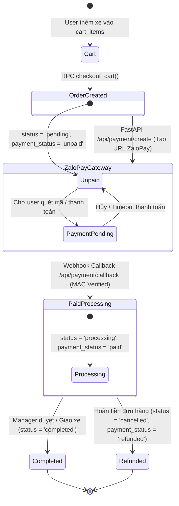
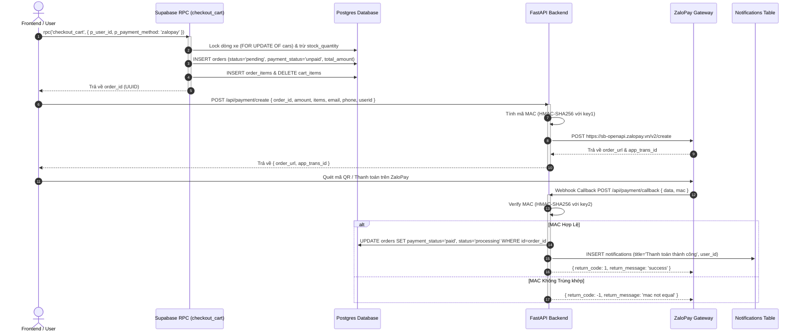
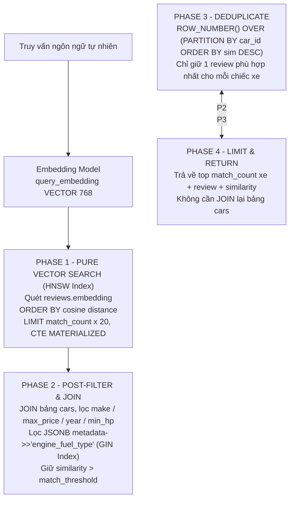
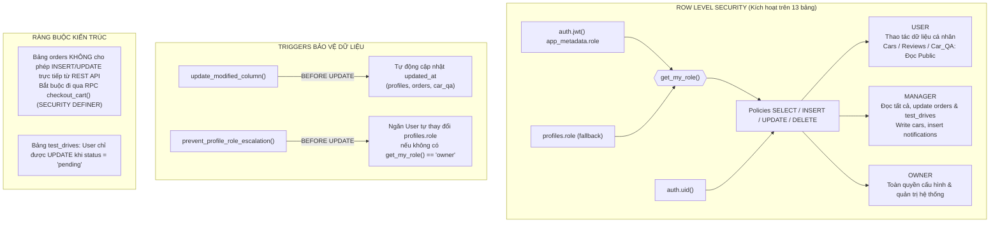

Dưới đây là bộ diagram Mermaid giải thích toàn bộ cấu trúc DB **E‑Commerce ô tô + AI Matching** (PostgreSQL/Supabase) và các logic hệ thống (State Machine, Security Triggers, ZaloPay Integration, Post-filter RAG).

## 1. ER Diagram — Toàn bộ bảng & khóa ngoại

```mermaid
erDiagram
    auth_users {
        UUID id PK
    }

    profiles {
        UUID id PK "FK auth_users"
        TEXT email UK
        TEXT full_name
        TEXT phone
        TEXT avatar_url
        TEXT role "user / manager / owner"
        TIMESTAMPTZ created_at
        TIMESTAMPTZ updated_at
    }

    cars {
        UUID id PK
        TEXT make "UNIQUE make model year"
        TEXT model
        INT year
        INT engine_hp
        BIGINT price "MSRP"
        JSONB metadata "GIN index"
        TEXT image_url
        INT stock_quantity
        BOOLEAN is_active
        TIMESTAMPTZ created_at
    }

    saved_cars {
        UUID id PK
        UUID user_id FK
        UUID car_id FK
        TIMESTAMPTZ created_at
    }

    test_drives {
        UUID id PK
        UUID user_id FK
        UUID car_id FK
        TIMESTAMPTZ scheduled_date
        TEXT status "pending confirmed completed cancelled"
        TEXT notes
        TIMESTAMPTZ created_at
    }

    orders {
        UUID id PK
        UUID user_id FK
        BIGINT total_amount
        TEXT status "pending processing completed cancelled"
        TEXT payment_method
        TEXT payment_status "unpaid paid refunded"
        TEXT contract_url
        TIMESTAMPTZ created_at
        TIMESTAMPTZ updated_at
    }

    order_items {
        UUID id PK
        UUID order_id FK
        UUID car_id "FK ON DELETE SET NULL"
        BIGINT price
        INT quantity
        TIMESTAMPTZ created_at
    }

    reviews {
        UUID id PK
        UUID user_id FK
        UUID car_id FK
        FLOAT rating
        TEXT comment
        TEXT source "user / edmunds"
        VECTOR768 embedding "HNSW cosine index"
        TIMESTAMPTZ created_at
    }

    car_qa {
        UUID id PK
        UUID car_id FK
        UUID user_id FK "nguoi hoi"
        TEXT question
        TEXT answer
        UUID answered_by FK "nguoi tra loi"
        TIMESTAMPTZ created_at
        TIMESTAMPTZ updated_at
    }

    viewed_cars {
        UUID id PK
        UUID user_id FK
        UUID car_id FK
        TIMESTAMPTZ viewed_at
    }

    search_history {
        UUID id PK
        UUID user_id FK
        TEXT query_text
        TIMESTAMPTZ created_at
    }

    chat_sessions {
        UUID id PK
        UUID session_id "index"
        UUID user_id "FK nullable cho guest"
        TEXT role "user assistant system"
        TEXT content
        TIMESTAMPTZ created_at
    }

    notifications {
        UUID id PK
        UUID user_id FK
        TEXT title
        TEXT content
        TEXT type
        BOOLEAN is_read
        TIMESTAMPTZ created_at
    }

    cart_items {
        UUID id PK
        UUID user_id FK
        UUID car_id FK
        INT quantity "CHECK quantity > 0"
        TIMESTAMPTZ created_at
    }

    auth_users ||--|| profiles : "id 1-1"
    profiles ||--o{ saved_cars : "user_id"
    cars     ||--o{ saved_cars : "car_id"
    profiles ||--o{ test_drives : "user_id"
    cars     ||--o{ test_drives : "car_id"
    profiles ||--o{ orders : "user_id"
    orders   ||--o{ order_items : "order_id"
    cars     ||--o{ order_items : "car_id"
    profiles ||--o{ reviews : "viet"
    cars     ||--o{ reviews : "nhan"
    profiles ||--o{ car_qa : "hoi"
    profiles ||--o{ car_qa : "tra loi"
    cars     ||--o{ car_qa : "co"
    profiles ||--o{ viewed_cars : "user_id"
    cars     ||--o{ viewed_cars : "car_id"
    profiles ||--o{ search_history : "user_id"
    profiles ||--o{ chat_sessions : "user_id"
    profiles ||--o{ notifications : "user_id"
    profiles ||--o{ cart_items : "user_id"
    cars     ||--o{ cart_items : "car_id"
```

---

## 2. Ma trận trạng thái đơn hàng & Thanh toán ZaloPay (State Machine)

Diagram mô tả vòng đời trạng thái của đơn hàng (`orders`) qua các bước từ giỏ hàng, khởi tạo ZaloPay đến khi xử lý Callback.

---

## 3. Sơ đồ tuần tự Checkout & Thanh toán ZaloPay End-to-End

---

## 4. Luồng `match_cars()` — Kiến trúc Vector Search Post-Filter

---

## 5. Security — RLS, Phân quyền 3 Tầng & Trigger Chống Nâng Quyền

---

### Điểm nhấn kiến trúc cần nhớ
- **`profiles` là "trạm trung tâm"**: 10/13 bảng FK về `profiles` (1‑1 với `auth.users`), `cars` là trung tâm catalog với 8 bảng FK tới.
- **Vòng đời Đơn hàng & ZaloPay**: `checkout_cart()` tạo đơn hàng ở trạng thái `pending`/`unpaid`. Sau khi nhận webhook `/api/payment/callback` với MAC verified, trạng thái tự động chuyển sang `processing`/`paid` và ghi nhận thông báo.
- **AI Layer nằm ở `reviews.embedding` (VECTOR 768 + HNSW)**: `match_cars()` dùng kiến trúc **post-filter** (vector search trước trên reviews → JOIN cars lọc sau → dedupe) để HNSW index luôn được dùng, tránh filter trước làm mất recall.
- **`cars.metadata` JSONB + GIN index**: Lưu thông số phụ (nhiên liệu, hộp số...) truy vấn JSON tốc độ cao.
- **`checkout_cart()` là cửa duy nhất tạo order** (SECURITY DEFINER): Lock dòng xe theo thứ tự `car_id`, trừ tồn kho, tính tổng, xóa giỏ — tất cả trong 1 transaction atomic.
- **Phân quyền 3 tầng** `user / manager / owner` qua `get_my_role()` (JWT claim → fallback `profiles.role`), kèm trigger chống tự nâng role.